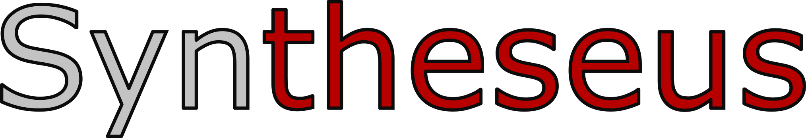

<div align="center">
    
    <h3><i>Navigating the labyrinth of synthesis planning</i></h3>
</div>

---

[](https://github.com/microsoft/syntheseus/actions/workflows/ci.yml)
[](https://www.python.org/downloads/)
[](https://github.com/ambv/black)
[](LICENSE)

Syntheseus is a package for end-to-end retrosynthetic planning.
- ⚒️ Combines search algorithms and reaction models in a standardized way
- 🧭 Includes implementations of common search algorithms
- 🧪 Includes wrappers for state-of-the-art reaction models
- ⚙️ Exposes a simple API to plug in custom models and algorithms
- 📈 Can be used to benchmark components of a retrosynthesis pipeline

## Setup

We support two installation modes:
- *core installation* allows you to build and benchmark your own models or search algorithms
- *full installation* additionally allows you to perform end-to-end search using some of the supported models

For core installation (minimal dependencies, no ML libraries) run

```bash
# Create and activate a new conda environment (or use your own).
conda env create -f environment.yml
conda activate syntheseus

pip install -e .
```

For full installation (including all supported models and dependencies for visualization/development) run

```bash
conda env create -f environment_full.yml
conda activate syntheseus-full

pip install -e ".[all]"
```

Both sets of instructions above assume you already cloned the repository via

```bash
git clone https://github.com/microsoft/syntheseus.git
cd syntheseus
```

Note that `environment_full.yml` pins the CUDA version (to 11.3) for reproducibility.
If you want to use a different one, make sure to edit the environment file accordingly.

Additionally, we also support GLN, but that requires a specialized environment and is thus not installed via `pip`. See [here](syntheseus/reaction_prediction/environment_gln/) for a Docker environment necessary for running GLN.

### Reducing the number of dependencies

To keep the environment smaller, you can replace the `all` option with a comma-separated subset of `{chemformer,local-retro,megan,mhn-react,retro-knn,root-aligned,viz,dev}` (`viz` and `dev` correspond to visualization and development dependencies, respectively).
For example, `pip install -e ".[local-retro,root-aligned]"` installs only LocalRetro and RootAligned.
If installing a subset of models, you can also delete the lines in `environment_full.yml` marked with names of models you do not wish to use.

Syntheseus contains two subpackages: `reaction_prediction`, which deals with benchmarking single-step reaction models, and `search`, which can use any single-step model to perform multi-step search.
Each is designed to have minimal dependencies, allowing it to run in a wide range of environments.
While specific components (single-step models, policies, or value functions) can make use of Deep Learning libraries, the core of `syntheseus` does not depend on any.

If you only want to use either of the two subpackages, you can limit the dependencies further by installing the dependencies separately and then running

```bash
pip install -e .  --no-dependencies
```

See `pyproject.toml` for a list of dependencies tied to each subpackage.

### Model checkpoints

See table below for links to model checkpoints trained on USPTO-50K alongside with information on how these checkpoints were obtained.
Note that all checkpoints were produced in a way that involved external model repositories, hence may be affected by the exact license each model was released with.
For more details about a particular model see the top of the corresponding model wrapper file in `reaction_prediction/inference/`.


| Model checkpoint link                                          | Source |
|----------------------------------------------------------------|--------|
| [Chemformer](https://figshare.com/ndownloader/files/42009888)  | finetuned by us starting from checkpoint released by authors |
| [GLN](https://figshare.com/ndownloader/files/42012720)         | released by authors |
| [LocalRetro](https://figshare.com/ndownloader/files/42012729)  | trained by us |
| [MEGAN](https://figshare.com/ndownloader/files/42012732)       | trained by us |
| [MHNreact](https://figshare.com/ndownloader/files/42012777)    | trained by us |
| [RetroKNN](https://figshare.com/ndownloader/files/42012786)    | trained by us |
| [RootAligned](https://figshare.com/ndownloader/files/42012792) | released by authors |

In `reaction_prediction/cli/eval.py` a forward model can be used for computing back-translation (round-trip) accuracy.
See [here](https://figshare.com/ndownloader/files/42012708) for a Chemformer checkpoint finetuned for forward prediction on USPTO-50K. As for the backward direction, pretrained weights released by original authors were used as a starting point.


## Development

Syntheseus is currently under active development.
If you want to help us develop syntheseus please install and run `pre-commit`
checks before committing code.

We use `pytest` for testing. Please make sure tests pass on your branch before
submitting a PR (and try to maintain high test coverage).

```bash
python -m pytest --cov syntheseus/tests
```

## Contributing

This project welcomes contributions and suggestions.  Most contributions require you to agree to a
Contributor License Agreement (CLA) declaring that you have the right to, and actually do, grant us
the rights to use your contribution. For details, visit https://cla.opensource.microsoft.com.

When you submit a pull request, a CLA bot will automatically determine whether you need to provide
a CLA and decorate the PR appropriately (e.g., status check, comment). Simply follow the instructions
provided by the bot. You will only need to do this once across all repos using our CLA.

This project has adopted the [Microsoft Open Source Code of Conduct](https://opensource.microsoft.com/codeofconduct/).
For more information see the [Code of Conduct FAQ](https://opensource.microsoft.com/codeofconduct/faq/) or
contact [opencode@microsoft.com](mailto:opencode@microsoft.com) with any additional questions or comments.

## Trademarks

This project may contain trademarks or logos for projects, products, or services. Authorized use of Microsoft
trademarks or logos is subject to and must follow
[Microsoft's Trademark & Brand Guidelines](https://www.microsoft.com/en-us/legal/intellectualproperty/trademarks/usage/general).
Use of Microsoft trademarks or logos in modified versions of this project must not cause confusion or imply Microsoft sponsorship.
Any use of third-party trademarks or logos are subject to those third-party's policies.
